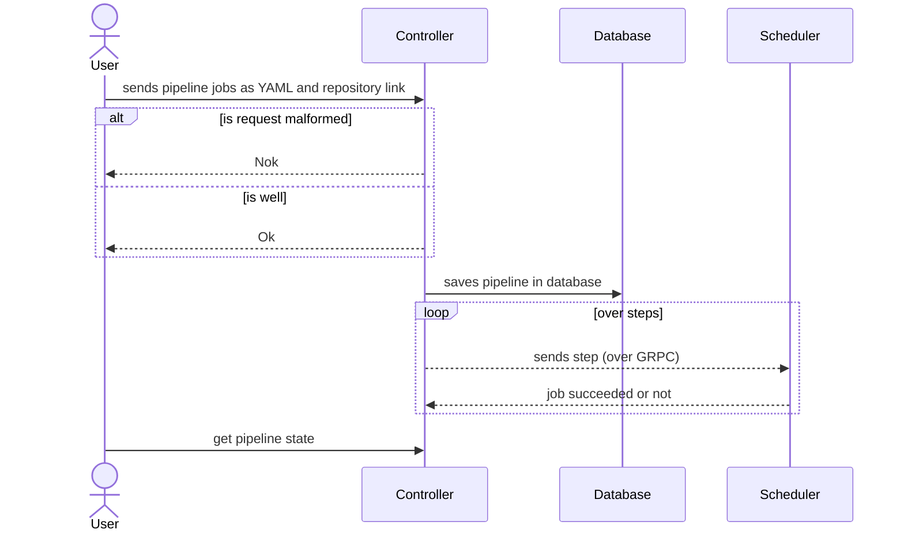

# Architecture Document for Controller Component

## Glossary
- action : list of steps, a declarative file can only contain one action.
- step : a step is the most atomic component of our pipeline.

## Component Description
- Controller component is an app directly interacting with the Monitor and the Scheduler.
It can receive 1 Action at a time through a REST API exposed directly on Internet. 

## Goals of the Controller
- Users can use the API to control/manage Actions/Steps
- Managing the actions progression
- Making sure the steps are executed in the right order

## Component Usage
- Action and step storage with its states
- It splits the Actions in "Steps", more atomic jobs.
- It stores the Steps, their related Action and their States
- It resolves Steps dependencies to define an order of execution
- It sends the Steps to the Scheduler
- It receives updates on the steps from the Scheduler and update his storage

