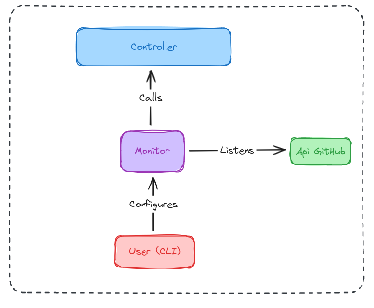

# Monitor

## Contributors

- Sarah THEOULLE
- Pauline CONTAT
- Thomas BROINE
- Baptiste BRONSIN

## Functionalities

- Listening events on a Git remote repository
- Recognition of the event and adapt the action according to the type of the event
- Calling the controller through an external API

## What

Based on user provided configuration, a monitor listens specific events from a git remote repository and takes some actions based on them.
We need to recognise the type of event, a `PR` (Pull Request) at first.
Depending on the type of the event, a yaml data will be generated and sent to the controller.

## Why

The goal is to trigger the controller to launch a CI accordingly to the detected event from the distant repository.
The `yaml` format has been chosen because the controller requires this type of file.

## How

**Set Up the Git Repository:** Configure the Git remote repository to detect specific events (like Pull Requests).
https://github.com/XAMPPRocky/octocrab

https://octocat-rs.github.io/book/ 

**Develop the Event Listener:** Create a api on a server that listens for incoming webhook notifications from the Git repository. This server will handle incoming events and process them.

**Recognize and Handle Events:** Implement logic to recognize different types of events (starting with Pull Requests) and take appropriate actions based on the event type.

**Generate YAML Data:** Based on the recognized event, generate the required YAML data.

**Send Data to the Controller:** Use an API to send the generated YAML data to the controller.

Notes Pauline :
The OpenAPI Specification (OAS) defines a standard, language-agnostic interface to HTTP APIs which allows both humans and computers to discover and understand the capabilities of the service without access to source code, documentation, or through network traffic inspection. When properly defined, a consumer can understand and interact with the remote service with a minimal amount of implementation logic.

An OpenAPI definition can then be used by documentation generation tools to display the API, code generation tools to generate servers and clients in various programming languages, testing tools, and many other use cases.