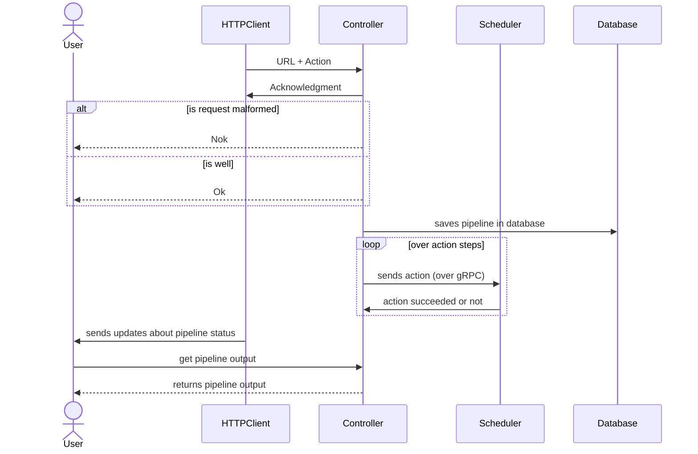

# Architecture Document for Controller Component

## Glossary

- A **pipeline** is a set of actions which define a workflow. A pipeline is declared in a `yaml` file (please, refer to the [structure](<#pipeline yaml definition>) section for the reference of each sections of this file).
- An **action** is a set of shell commands to execute on a specific environment.

## Description

The Controller is the component that translates a pipeline declaration file into a list of actions to be executed, it also reflects the result of each actions so the user knows if a pipeline succeeded or failed. To do that, it receives [pipelines](#pipeline), parse them into a set of [actions](#actions) and send these actions sequentially to the Scheduler, for each of these actions, the Scheduler **must** notify the Controller when a action has been scheduled and has been completed successfully or encountered an error. Thanks to these information, the Controller is able to provide information about a pipeline state to anyone (the Monitor or any other client).

## Features

- Users send pipelines containing actions to execute. Pipelines are described through [YAML formatted files](<#Pipeline YAML Definition>).
- Users can track there actions by getting the logs from the Agent, the states of the action : `PENDING`, `SCHEDULED`, `RUNNING`, `COMPLETED`. Refer to the sections [actions/states](#States).
- The controller makes sure that each actions are executed in the right order (by design) and doesn't execute the next action if the previous one has failed.

### Pipeline YAML definition

#### Global example

```yaml
actions:
  postinstall:
    configuration:
      container: debian:latest
    commands:
      - apt update
      - apt install mfa-postinstall
  build:
    configuration:
      container: dind:latest
    commands:
      - docker run debian:latest
```

#### `actions`

A pipeline is made up of one or more `actions`, which run sequentially.

Pipelines also define their execution environment, i.e the container image they must be run into.

#### `actions.<action_id>`

`<action_id>` is the action identifier. It allows for retrieving specific details about the action through the controller HTTP API.

There can be multiple actions in one pipeline but the `action id` must be unique.

**Usage example**

```yaml
actions:
  postinstall:
  ...
```

Here `postinstall` is the identifier of your action.

#### `actions.<action_id>.configuration`

The action execution environment configuration.

> [!Note]
> At the moment this section only describes the action container image, but may be extended in the future with e.g. environment variables.

#### `actions.<action_id>.configuration.container`

The container image URI the action must run on.

**Example :**

```yaml
actions:
  postinstall:
    configuration:
      container: debian:latest
```

#### `actions.<action_id>.commands`

`command` is a **list** of shell commands that will be executed during the action.
**Example**

```yaml
actions:
  postinstall:
    configuration:
      container: debian:latest
    commands:
      - apt update
      - apt install mfa-postinstall
```

### HTTP Request (Input)

The controller triggers a pipeline once it receives its corresponding manifest. To do so, an HTTP client must send a POST request containing the manifest file and the name of the pipeline.

- `POST` /pipeline :

  **Body**:

  - `name` : a `string` that corresponds to the pipeline name.

  - `body` : a `file` that is the manifest file conform to the structure declared bellow.

> [!Note]
> The request **must** be a multipart/form-data since the pipeline file could be quite long.

### HTTP Response (Output)

The pipeline needs to inform the user on the state of the actions, therefore it needs to provide outputs. Outputs aim to describe each actions state to get an insight on what is going on in your pipeline. An output has an **header** that must have one of the following value : `PENDING`, `SCHEDULED`, `RUNNING` and `COMPLETED`.

#### States

- `PENDING` : the action has not been sent to the Scheduler yet.

  **Payload** : none.

- `SCHEDULED`: the action has been received by the Scheduler but has not been assigned to an Agent.

  **Payload** : none.

- `RUNNING` : the action has been assigned to an Agent but not completed.

  **Payload** : logs from the agent (these logs can change during the execution of the action so they need to be re-fetched to be up to date).

- `COMPLETED` : the action has finished. It can be either a success or a failure depending on the HTTP status code.

  **Payload** : none.

## Diagrams

### Sequence diagram


