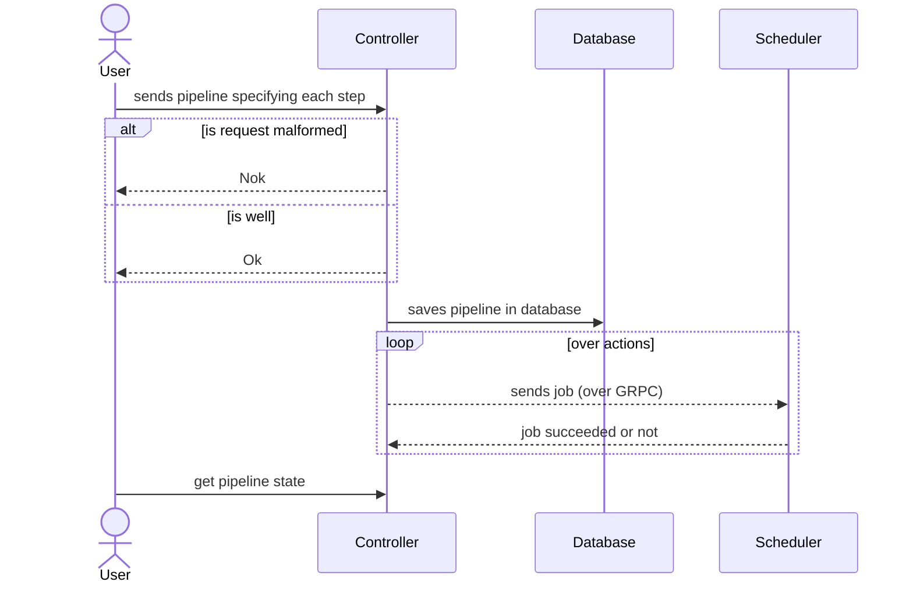

# Architecture Document for Controller Component

## Description
The Controller is the component giving meaning to the [pipeline](#structure) file given by the Monitor. It receives [pipelines](#pipeline), parse them into a set of [actions](#actions) and send these actions sequentially to the Scheduler, for each of these actions, the Scheduler **must** notify the Controller when a job has been scheduled and has been completed successfully or encountered an error, it can be done just by sending the logs from the Agent.  Thanks to these information, the Scheduler is able to provide information about a pipeline state to anyone (the Monitor or any other client).
## Features
- Users can send pipelines containing actions to execute. These actions are basically shell commands to execute. These pipelines are `yaml` files.
- Users can track there actions by getting the logs from the Agent, the states of the job : `TODO`, `PENDING`, `DOING`, `COMPLETED`, `ERROR`. Refer to the sections [actions/states](#States).
- The controller makes sure that each actions are executed in the right order (by design) and doesn't execute the next action if the previous one has failed.'
## Pipeline
A pipeline is a set of actions that are executed in sequence. It is represented as a `yaml` file (please, refer to the [structure](#structure) section for the reference of each sections of this file). A pipeline fails if one of its actions fail. If none of its actions fail then the pipeline succeeds.
### Structure
#### `jobs`
A pipeline is made up of one or more `jobs`, which run sequentially.
#### `jobs.<job_id>`

### Outputs
## Actions
### States
- `TODO` : the step has not been sent to the Scheduler yet.
- `PENDING`: the step has been received by the Scheduler but has not been assigned to an Agent.
- `DOING` : the step has been assigned to an Agent but not completed.
- `COMPLETED` : the step has finished successfully.
- `ERROR`: the step has completed but encountered an error.